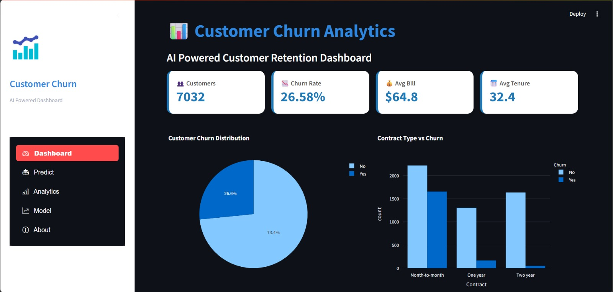
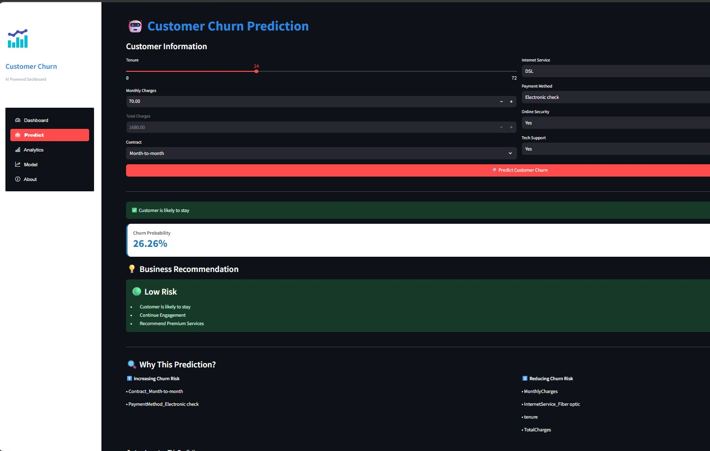
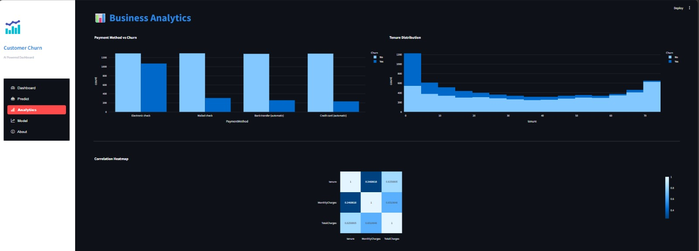
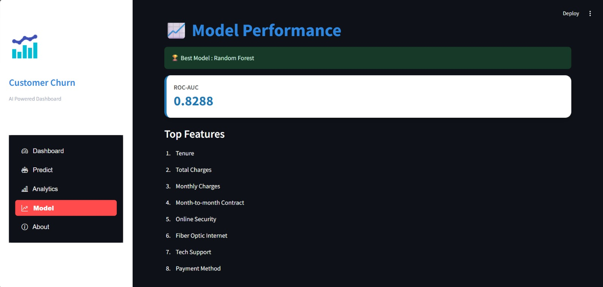

# 📊 Customer Churn Analytics & Prediction

An end-to-end Machine Learning project that predicts customer churn using the IBM Telco Customer Churn dataset and provides interactive business insights through a Streamlit dashboard - complete with SHAP-based prediction explainability.

---

## 🚀 Project Overview

Customer churn is one of the biggest challenges faced by subscription-based businesses. This project predicts whether a customer is likely to churn based on customer demographics, contract details, billing information, and services used - and explains *why* each individual prediction was made.

The project includes:

- Exploratory Data Analysis (EDA)
- Data Preprocessing
- Feature Engineering
- Machine Learning Model Training & Comparison
- Real-Time Customer Churn Prediction
- SHAP-Based Model Explainability
- Interactive Streamlit Dashboard
- Business Recommendations Based on Risk Level

---

## ✨ Features

- 📈 Interactive analytics dashboard
- 🤖 Real-time customer churn prediction
- 🔍 SHAP explainability - see exactly which factors drive each prediction
- 📊 Business KPI cards
- 📉 Customer churn visualizations
- 💡 Automated retention recommendations by risk tier
- 🧠 Random Forest ML model (compared against Logistic Regression baseline)
- 🎨 Clean, custom-styled and responsive Streamlit UI

---

## 🛠 Tech Stack

### Programming Language
- Python

### Libraries
- Pandas
- NumPy
- Scikit-learn
- SHAP
- Plotly
- Streamlit
- Streamlit-option-menu
- Joblib

### Machine Learning
- Random Forest Classifier
- Logistic Regression (baseline)
- Scikit-learn Pipeline + ColumnTransformer
- One-Hot Encoding
- Standard Scaling
- SHAP TreeExplainer

---

## 📂 Project Structure

```text
Customer-Churn-Analytics/
│
├── data/
│   ├── telecom_churn.csv
│   ├── X_train.csv
│   ├── X_test.csv
│   ├── y_train.csv
│   └── y_test.csv
│
├── model/
│   ├── churn_pipeline.pkl      # Final production model (Pipeline: preprocessing + RF)
│   ├── feature_names.pkl
│   └── scaler.pkl
│
├── notebooks/
│   └── 01_EDA.ipynb
│
├── images/
│   ├── Dashboard.jpeg
│   ├── Predict.png
│   ├── Analytics.jpeg
│   ├── Model.jpeg
│   └── About.jpeg
│
├── app.py                       # Streamlit application
├── train.py                     # Final training script (Pipeline-based)
├── style.css
├── requirements.txt
├── README.md
└── .gitignore
```

---

## 📊 Dataset

**IBM Telco Customer Churn Dataset**

The dataset contains customer information such as:

- Gender, Senior Citizen, Partner, Dependents
- Contract Type, Tenure, Payment Method
- Monthly Charges, Total Charges
- Internet Service, Online Security, Tech Support
- Churn Status (target variable)

Total Records: **7,043**

---

## 📈 Exploratory Data Analysis

Performed comprehensive EDA including:

- Customer Churn Distribution (~26.5% churn rate)
- Contract Type vs Churn (month-to-month customers churn far more)
- Internet Service Analysis (fiber optic customers churn more than DSL)
- Monthly Charges Distribution vs Churn
- Payment Method Analysis (electronic check users churn more)
- Correlation Heatmap
- Customer Tenure Analysis (low tenure = high churn risk)

---

## ⚙️ Machine Learning Pipeline

### Data Preprocessing
- Missing value handling (`TotalCharges` blank-string → numeric → dropna)
- One-Hot Encoding for categorical features
- Standard Scaling for numeric features
- Stratified Train-Test Split (80/20)

### Models Compared

| Model | ROC-AUC | Churn Recall | Churn Precision |
|---|---|---|---|
| Logistic Regression | 0.836 | 0.57 | 0.65 |
| **Random Forest** | **0.838** | **0.76** | 0.53 |

### Best Model: ✅ Random Forest

Random Forest was selected primarily for its significantly higher **recall on the churn class (76% vs 57%)** - for a retention use case, catching more at-risk customers (even at some precision cost) is more valuable than a marginally higher accuracy, since the cost of losing a customer typically outweighs the cost of an unnecessary retention offer.

---

## 📊 Important Features (Model-Derived)

The Random Forest model identified these as the most influential factors driving churn:

1. Tenure
2. Total Charges
3. Two-Year Contract (protective factor)
4. Monthly Charges
5. Fiber Optic Internet
6. Electronic Check Payment
7. One-Year Contract
8. Online Security
9. Tech Support
10. Device Protection

---

## 🔍 SHAP Explainability

Beyond global feature importance, this project uses **SHAP (SHapley Additive exPlanations)** to explain *individual* predictions in real time. For every customer scored on the Predict page, the app shows:

- Which specific factors pushed **this customer's** risk **up** (e.g. month-to-month contract, low tenure)
- Which factors pulled it **down** (e.g. long tenure, two-year contract)
- A visual bar chart ranking feature impact for that prediction

This turns a black-box probability score into an actionable, explainable insight - the kind of transparency that matters in real retention workflows.

---

## 🖥 Dashboard

The Streamlit application includes:

### 📊 Dashboard
KPI cards, churn distribution, contract analysis, internet service analysis, monthly charges analysis

### 🤖 Prediction
Enter customer details to predict churn probability, view risk tier, get SHAP-based explanations, and receive business recommendations

### 📈 Analytics
Payment method trends, tenure distribution, correlation heatmap

### 🧠 Model Performance
Accuracy, ROC-AUC, best model, top features

---

## 💡 Business Recommendations

The application categorizes customers into three risk tiers:

### 🔴 High Risk (≥80% churn probability)
- Loyalty discounts
- Annual contract offers
- Premium customer support
- Immediate follow-up

### 🟠 Medium Risk (50–79%)
- Promotional plans
- Personalized offers
- Scheduled engagement

### 🟢 Low Risk (<50%)
- Upselling opportunities
- Premium service recommendations
- Continued regular engagement

---

## 🚀 Installation

Clone the repository

```bash
git clone https://github.com/SruthiK30/Customer-Churn-Analytics.git
```

Navigate into the project

```bash
cd Customer-Churn-Analytics
```

Install dependencies

```bash
pip install -r requirements.txt
```

Run the Streamlit app

```bash
streamlit run app.py
```

---

## 📸 Screenshots

### Dashboard


---

### Prediction Page (with SHAP Explainability)


---

### Analytics


---

### Model Performance


---

## 🔮 Future Improvements

- Hyperparameter optimization (GridSearchCV / Optuna)
- Customer segmentation clustering
- Cloud deployment (Streamlit Community Cloud)
- SQLite integration for business analytics via SQL queries
- A/B testing framework for retention offer effectiveness

---

## 👩‍💻 Developed By

**Sruthi K**

B.E. Computer Science Engineering

AI | Machine Learning | Data Analytics | Software Development

GitHub: https://github.com/SruthiK30

LinkedIn: https://www.linkedin.com/in/sruthi30082004

---

## ⭐ If you found this project useful, don't forget to star the repository!